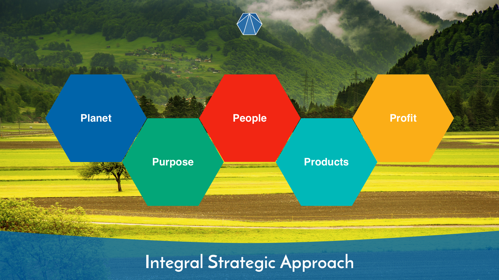
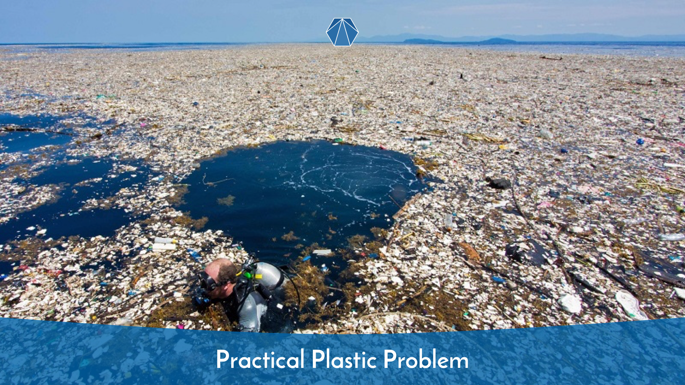
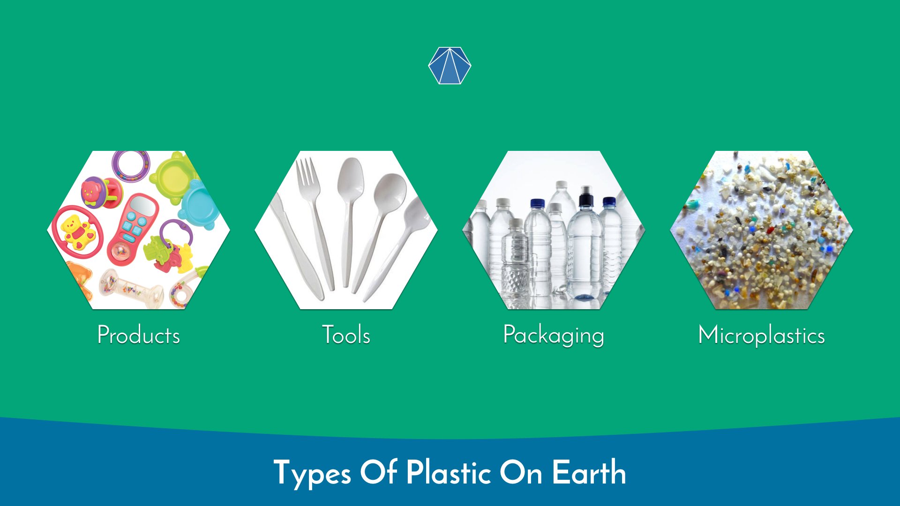
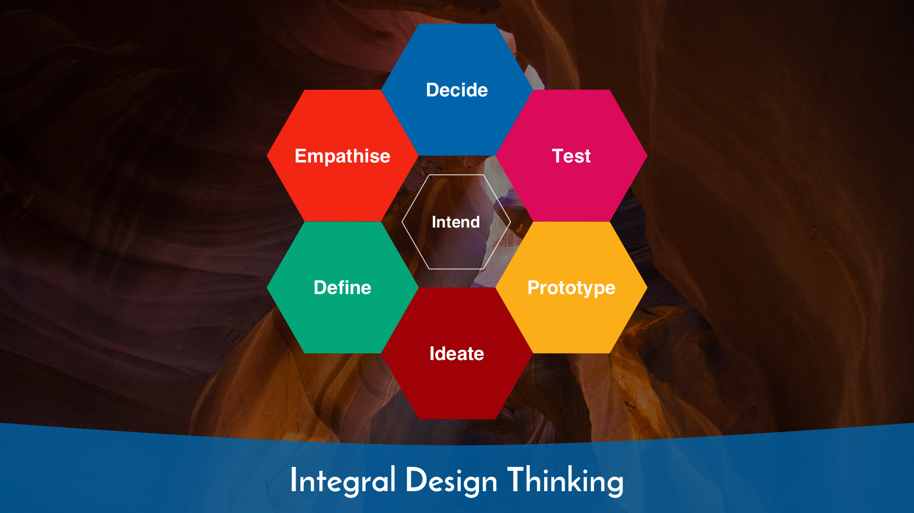
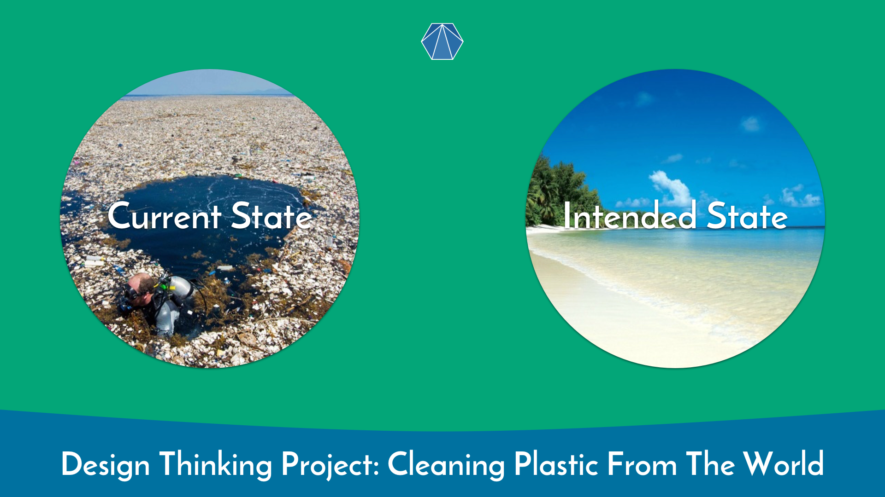

# Plastic Free Planet - A Design Thinking Project by Integral

## Contents

* [Introduction](#introduction)
* [Problem](#problem)
* [Plastic](#plastic)
* [Approach](#approach)
* [Design Thinking](#design-thinking)
* [Aim](#aim)

## Introduction

[Integral](http://integral.me "Integral website")'s mission is Redesigning Humanity.

It all starts with our planet Earth.

This is Integral's planetary manifesto for a plastic free Earth's.

## Problem

The problem of plastic pollution of The Earth is ever increasing.

It is threatening existence of entire living ecosystems.

Much of plastic used is discarded as rubbish into the ground and water, ending up in rivers and seas around the world.

Eventually, plastic finds itself re-entering the food cycle back into human food supply via animals which humans consume.

The plastic problem is huge and is becoming bigger all the time.

Plastic gets used for making different types of things:

* Products
* Tools
* Packaging
* Microplastics

Many of the above things should not be made or used in the first place.

Others can be minimised or eliminated through redesigning processes and approaches to making things.

The main issue is that plastic is not good for the environment.

Today, there are many alternative solutions to plastic which are good for The Earth and do no damage the environment.

Plastic pollution could potentially have devastating effects on the future of The Earth and humanity.

It could cause irreversible damage to animal and human health for the long term.

In many respects, it's already doing so.

## Plastic

During the industrial revolution, plastic became a widely used material for creating many different things.

Companies didn't think about the long term impact of plastic waste on The Earth's environment.

Plastic things come under these categories:

### Products

Examples include:

* Shopkins
* Plastic cards
* LEGO
* Kinder Egg toys
* Plastic balls

### Tools

Examples include:

* Toilet seats
* Plastic cutlery
* Kettles
* Boxes
* Plugs
* Straws
* Plastic forks and spoons
* Coffee cup tops
* Lighters
* Selotape
* Disposable plates and cups
* Envelope see through windows
* Oyster and credit/debit cards ('put it on plastic')
* Pipes and gutters
* Bins
* Toothbrushes

### Packaging

Examples include:

* Plastic bags
* Plastic wrapping
* Disposable lunch boxes
* Plastic bottles

### Micro plastics

Examples include:

* Toothbrush micro plastic
* Makeup micro plastic
* Shavings and shards in water bottles
* Plastic beads

## Approach

Before we can do anything about the plastic problem in the world, we need to understand the context which creates this problem and impacts on the solutions.

Our approach will cover following aspects:

### Causes of problem

* Causes of plastic pollution
* Analysis of plastic pollution distribution
* Impact of plastic on the planet
* Human activities which use plastic
* Actors and stakeholders in plastic industries

### Possible solutions

* Solutions which reduce and eliminate plastic usage from day to day life
* Principles eliminating plastic from considerations as a solution to improving human life experience
* Alternative options to plastic
* Awareness raising ideas for this project as well as plastic elimination ideas

We will use Design Thinking to map out problems and solutions to these problems.

## Design Thinking

Design Thinking approach consists of:

### Intend
Setting out our intention on what we are aiming to do

### Decide
Deciding on scope of the project

### Empathise
Understanding the human actors and their emotions within the plastic pollution problem

### Define
Framing the problem in the right and holistic way

### Ideate
Coming up with ideas on how to potentially solve the problem

### Prototype
Model the ideas in practical ways

### Test
Put the models into practice and simulate how they would work

## Aim

In the current state, the world is increasingly polluted by all sorts of plastic things.

Our intension is to enable a creation of a plastic free Earth.

So our intended state is to create a sustainably plastic free, pristine clean Earth.

# Further Reading and Inspiration

* [Planet or Plastic](https://www.nationalgeographic.com/environment/planetorplastic/)
* [Guatemala plastic barriers](https://twitter.com/AdamRogers2030/status/1001901475805716480)
* [Tea bags release millions of micro plastic particles into brew](https://www.independent.co.uk/life-style/food-and-drink/tea-bags-plastic-particles-polypropylene-biodegradable-a9119771.html) 

# Positive news 

* [Unilever pledges to cut plastic use by half](https://www.theguardian.com/business/2019/oct/07/unilever-pledges-to-halve-use-of-new-plastics)